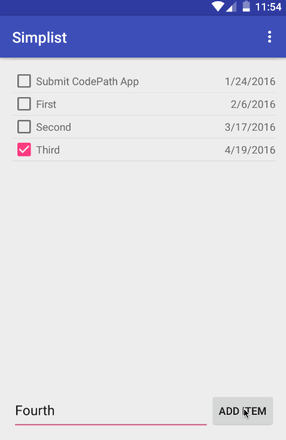

# Simplist
This is a simple to-do list application for Android.

Time spent: 6 hours in total

### Completed user stories:

- [x] Required: User can add and remove items from the todo list
- [x] Required: User can edit items in the todo list
- [x] Required: Todo items are persistent
- [x] Optional: Persist todo items into SQLite instead of a text file
- [x] Optional: Improve style of todo items using a custom adapter
- [x] Optional: Add support for completion due dates for todo items (and display within listview item)

### Walkthrough for all user stories:

GIF created with [LiceCap](http://www.cockos.com/licecap/).
